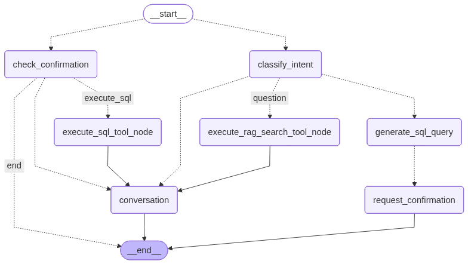

# LangGraph Agentic AI Chat Assistant

An intelligent **Agentic AI Chat Assistant** powered by **LangGraph + FastAPI**, designed to classify user intent, extract key data, and perform dynamic calculations such as **pension or insurance estimation** — all managed seamlessly using **UV**, the next-gen Python package manager.

---

## 🧠 How It Works

**Example Flow**



---

## ⚙️ Setup Instructions

*(Written painlessly for you by Lakmalllllll 😎)*

---

### 🧩 Prerequisites

> **⚠️ Requires Python 3.10 or higher**

Make sure **UV** is installed:

```bash
pip install uv
```

---

### 🏗️ Project Setup

Clone the repository:

```bash
git clone https://github.com/yourusername/chatbot-langraph-backend.git
cd chatbot-langraph-backend
```

---

### 🪄 Install Dependencies (with UV)

```bash
uv sync
```

UV will:

* Automatically create a virtual environment in `.venv/`
* Install all dependencies from `pyproject.toml`
* Lock versions inside `uv.lock`

---

### ▶️ Activate the Environment

**Windows:**

```bash
.venv\Scripts\activate
.\.venv\Scripts\Activate.ps1
```

**macOS/Linux:**

```bash
source .venv/bin/activate
```

---

### 🔑 Environment Variables

Create a `.env` file in the project root:

```bash
OPENAI_API_KEY=your_openai_api_key_here
OPENAI_AI_MODEL=your_openai_model_name
```

---

### 🚀 Run the Application

Start the FastAPI server with:

```bash
uv run uvicorn main:app --reload
```

Your app will start at:
👉 [http://127.0.0.1:8000](http://127.0.0.1:8000)

API Docs:
👉 [http://127.0.0.1:8000/docs](http://127.0.0.1:8000/docs)

---

### 🧪 Run Tests

```bash
uv run pytest
```

---
###alembic commands
alembic revision --autogenerate -m "initial migration"
alembic upgrade head 
alembic revision --autogenerate -m "create new pension scheme tables"
alembic upgrade head 
-----


💡 **Tip:** Once running, talk to your AI assistant about pensions, vehicles, or crop insurance — and watch **LangGraph nodes** perform intent classification, entity extraction, and intelligent reasoning in real time.
=======
# chatbot-langraph-backend
>>>>>>> 7d330e0 (Initial commit)
